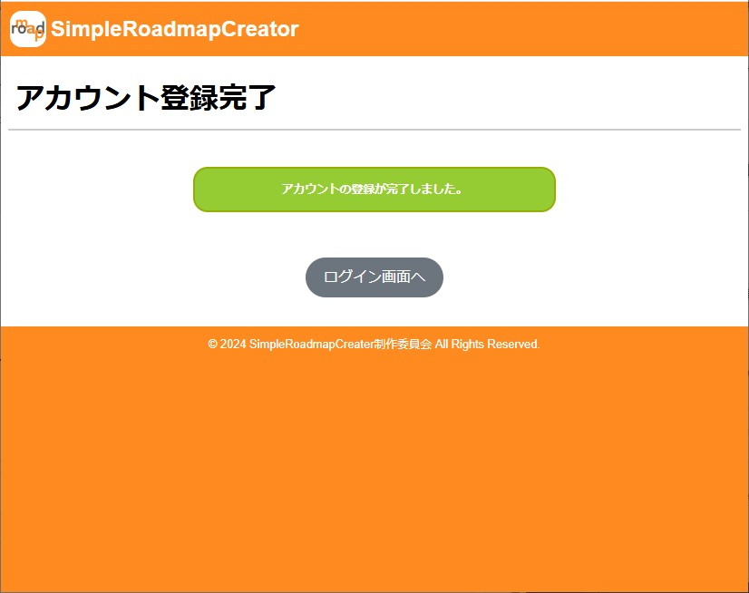

# アプリケーション名
ロードマップ作成アプリ
# 1. プロジェクトについて
## 作成の背景
ロードマップを作成できる無料のWebアプリケーションはあるが、日本語対応かつシンプルなものがあれば日本で広く使われやすいと感じたため作成した。
特に、年単位といった長期スパンの目標であれば、中目標と小目標の適切な設定により、現在位置の把握がモチベーション維持に繋がると考えられる。

## ターゲット
・学習や就職などの目標を可視化したいと考えるユーザー  

## 概要
・ユーザー単位でのロードマップ作成、保存が可能  
・作成したロードマップを大目標、ロードマップ内の親要素を中目標、親要素に付随する子要素を小目標として、大目標に対する中目標と小目標を必要に応じて作成可能  
・中目標と小目標にあたる要素のステータスを「完了」とすることで、該当要素がグレーアウトするため、進捗状況を視覚的に確認可能  

## 仕様書
[要件定義書_ロードマップ作成アプリ](要件定義書_ロードマップ作成アプリ.pdf)  

# 2. 環境
## 開発環境
- OS: Windows 10
- IDE: Eclipse 2023
- サーバー: Apache Tomcat 10 (Java 21対応)
- データベース: H2 Database Engine 2.3.232

## 使用言語・技術
- バックエンド: Java SE 21
- フロントエンド:
  - HTML5
  - CSS3
  - JavaScript

# 3. デモ画面
a. トップ画面[ログイン画面]  
アプリケーションを起動するとトップ画面(ログイン画面)が表示されます。  
この画面からアカウント登録またはログインを実行できます。

b. アカウント登録画面  
トップ画面から遷移できる画面で、アカウントの登録処理が可能です。  
使用済みのユーザー名は使用不可、ユーザー名およびパスワードは10文字以内で設定可能です。  
入力内容に問題がなければ登録完了画面が表示されます。  

c. マイページ画面
トップ画面からログイン成功すると遷移する画面です。  
画面下側部分に、今までに作成したロードマップがユーザー単位で作成日時順で表示されます。  
ロードマップを新規作成する場合は「新規作成」ボタンを押下します。  
また、「アカウント削除」「ログアウト」ボタン押下で各々の処理が実行されます。  
  

d. ロードマップ新規作成画面
ロードマップを作成するために必要最小限の情報を入力する画面です。  
ロードマップの名称、親要素および所属する子要素に関する名称、順番、子要素のタグを入力します。  
作成する親要素と子要素は必要に応じて、追加ボタンと削除ボタンで増減が可能です。  
必要情報を入力後は、「作成」ボタンを押下することで次のロードマップ表示画面に遷移します。  
※順番は作成順のため、その要素の番号になるわけではありません。  
  

e. ロードマップ表示画面
作成したロードマップに関して、その内容を表示する画面です。  
画面左上にはロードマップのタイトルと日時情報が表示されます。  
親要素または子要素を追加したい場合は画面右上の「親要素の追加」ボタン、「子要素を追加」ボタンで実行可能です。  
描画されている各要素をクリックすると、各々の内容を格納したモーダル画面が表示されます。  
要素の色が暗くなっている部分は、後述するステータスを「完了」とした場合を表しています。  
また、表示中のロードマップをコピーまたは削除したい場合は右上のボタンを押下することで各々実行可能です。  
「マイページ」ボタンを押下するとマイページに遷移します。  
  

f. 親要素・子要素のモーダル画面
ロードマップ表示画面にて、表示された要素をクリックすると開く画面です。  
上から、要素名・要素番号・タグ(子要素のみ)・ステータス・内容となり、ユーザーはこの画面上で内容の変更が可能です。  
内容入力後は「変更」ボタンを押下すると、変更内容が反映されたロードマップ表示画面に遷移します。  
また、要素単位で削除する場合は右上の「要素の削除」ボタンで実行可能で、削除対象が親項目の場合は子項目もあわせて削除されます。  
※内容部分は最大10000字まで入力可能
※画像1つ目は親要素、2つ目は子要素のモーダル画面

# 4. 実行準備
## スタートファイル
アプリケーション起動(またはLoginServlet)
## 初期パスワード(デモアカウントのログイン情報)
ユーザー名："test"  
パスワード："test"  
## 手順
1. GitからZIPをダウンロードおよび解凍
2. 解凍したファイルのうち、「simpleRoadmapCreator」フォルダをEclipse2023のワークスペースに配置
3. Eclipse上で既存プロジェクトとしてインポート
4. データベースファイル「db.mv.db」を、デスクトップ上に「simpleRoadmapCreator」フォルダを作成して、その中に配置
5. 上述のスタートファイルに対してサーバーで「実行」->「サーバーで実行」(Tomcat10(Java21))

# 5. その他
## ライセンス
このアプリケーションは以下のオープンソースライブラリを使用しています。各ライブラリは、それぞれのライセンス条項に基づいて使用しています：

1. **D3.js**
   - **著作権**: Copyright (c) 2010-2023 Mike Bostock
   - **ライセンス**: BSD 3-Clause "New" or "Revised" License
   - **詳細**: [D3.js License](https://github.com/d3/d3/blob/main/LICENSE)
   - **概要**: D3.jsはデータ駆動型ドキュメントを操作するためのJavaScriptライブラリです。

2. **Micromodal.js**
   - **著作権**: Copyright (c) 2017 Indrashish Ghosh
   - **ライセンス**: MIT License
   - **詳細**: [Micromodal.js License](https://github.com/ghosh/Micromodal/blob/master/LICENSE.md)
   - **概要**: Micromodal.jsは、シンプルで軽量なモーダルウィンドウライブラリです。

3. **gson-2.11.0**
   - **著作権**: Copyright (c) 2008 Google Inc.
   - **ライセンス**: Apache License 2.0
   - **詳細**: [gson License](https://github.com/google/gson/blob/main/LICENSE)
   - **概要**: GsonはJavaオブジェクトとJSONとの相互変換を行うライブラリです。

4. **Jackson Core (2.18.2), Jackson Annotations (2.18.2), Jackson Databind (2.18.2)**
   - **著作権**: Copyright (c) 2007- Tatu Saloranta, tatu.saloranta@iki.fi
   - **ライセンス**: Apache License 2.0
   - **詳細**: [Jackson License](https://github.com/FasterXML/jackson-databind/blob/master/LICENSE)
   - **概要**: JacksonはJavaでJSONデータを処理するための高性能なライブラリです。

5. **Jakarta Standard Tag Library (JSTL) (3.0.1), Jakarta Standard Tag Library API (3.0.0)**
   - **著作権**: Copyright (c) 2018 Oracle and/or its affiliates. All rights reserved.
   - **ライセンス**: Eclipse Public License 2.0 または GNU General Public License v2.0 with Classpath Exception
   - **詳細**: [Jakarta Standard Tag Library License](https://github.com/eclipse-ee4j/jstl-api/blob/master/LICENSE.md)
   - **概要**: JSTLはJavaServer Pages（JSP）用の標準タグライブラリです。

詳細については上記のリンクをご参照ください。

